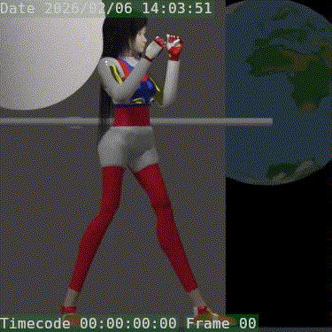
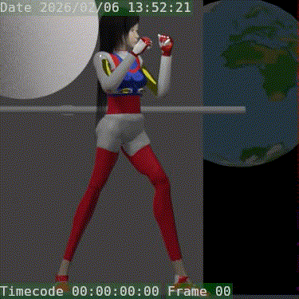
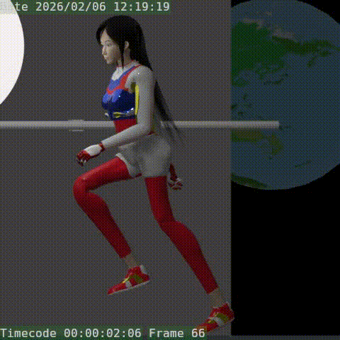
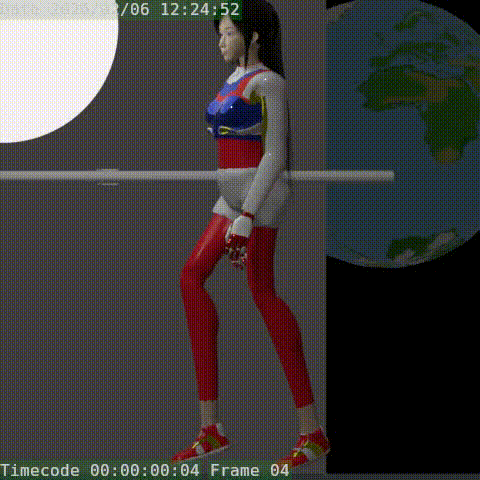

# 2026 Python 3rd Person Controller System
UPBGE 0.50 | Fully Scripted | State-Driven Architecture
Author: Evan Charles McArthur  

---

Overview

A modular third-person combat framework built in UPBGE 0.50 using Python.

This project focuses on deterministic state control, layered animation authority, and modular combat architecture rather than prototype-level scripting.

The goal was to design a reusable, inspectable, production-oriented controller system that avoids hidden state coupling and animation deadlocks.

# Core Features

2 fully playable characters

25+ animation clips per character

Layered animation system (locomotion + action override)

Lock-on targeting system

Combo-based attack handling

Dodge system with cooldown logic

AI opponent system

12-foot Reptile Oni boss character

Hitbox-driven damage messaging

Collectible + state-based world interaction system

System Architecture

The framework is structured around explicit state authority.

Movement, animation, and combat are resolved in a deterministic order each frame.

Input
  ↓
State Resolution
  ↓
Movement Authority (Character Physics)
  ↓
Animation Controller (Layered)
  ↓
Combat & Hit Detection
  ↓
AI / World Interaction

Each layer has a clear responsibility and avoids cross-coupling.
---

## Project Structure
```
2026 Python 3rd Person Controller System/
│
├── AI_Opponent_Script/
├── Documents/
├── Media/
│ ├── LLAHooks0_48.gif
│ ├── LLAJab0_22.gif
│ ├── LLARearJab0_21.gif
│ ├── LLARun66_95.gif
│ ├── LLARun6695.gif
│ └── LLAWalk4_35.gif
│
├── Player_Script/
│ ├── AttackController.py
│ ├── camControllerA.py
│ ├── Grounded.py
│ ├── handle_inputScript.py
│ ├── MCAnimationController.py
│ └── moveJoyM.py
---
```

## Core Systems

### 1. Movement System
- Ground detection
- Forward & strafe locomotion
- Walk / Run thresholds
- Jump / Fall states
- Lock-on directional strafe logic

### 2. Animation Controller (MCAnimationController.py)
Layered animation logic:

- **Layer 0** → Locomotion (looped)
- **Layer 1** → Action override (attacks, dodge, etc.)
- State tracking with:
  - `last_state`
  - `locomotion_dirty`
  - `action_state`
- Automatic resync after action completion

This prevents animation lockups and ensures clean state transitions.

---

### 3. Combat System
- Attack combo handling
- Action override suppression of locomotion
- Dodge system
- Frame-controlled action playback

### Combat Samples

#### Jab


#### Hook


---

### 4. Locomotion Samples

#### Run


#### Walk


---

# Movement System

Character physics-based locomotion

Ground detection

Forward & strafe movement

Walk / run thresholds

Jump / fall states

Lock-on directional remapping

Action-state locomotion suppression

Movement authority is resolved once per frame to prevent drift or conflicting motion sources.

# Animation System

MCAnimationController.py

Layered structure:

Layer 0 → Locomotion loop

Layer 1 → Action override (attacks, dodge, etc.)

Key properties:

action_state

last_state

locomotion_dirty

input_moving

Features:

Deterministic override control

Automatic locomotion resynchronization

Explicit state transition handling

Deadlock prevention

All state values are inspectable in Blender’s Game Properties panel for debugging clarity.

# Combat System

Combo-capable attack handling

Action override suppression of movement

Hitbox-based collision detection

Damage messaging system

One-shot prevention safeguards

Dodge timing and cooldown logic

Combat behavior is driven by state transitions rather than animation events.

Lock-On System

Target acquisition logic

Toggle system with cooldown

Directional movement remapping

Camera alignment

Forced locomotion resync on toggle

Prevents desynchronization between camera, character orientation, and movement direction.

# AI System

Target tracking

Distance-based behavior switching

State-aware attack triggers

Damage reception system

Designed to allow expansion toward more advanced behavior trees.

World Interaction System

Collectible system with global state tracking

Conditional world-object reveal system

Event-driven progression logic

Demonstrates object lifecycle management and persistent state handling.

# Technical Specifications

Engine: UPBGE 0.50

Language: Python

Physics: Character Controller

Architecture: Modular controller scripts

Blend size: < 300MB

Animations: 25+ per character

Input: Keyboard + Gamepad

Development Lessons
1. Movement Authority Must Be Singular
Multiple movement sources create subtle drift and desync.
Resolving locomotion once per frame prevents compounding bugs.

2. Animation Should Follow State — Not Drive It
Explicit state control eliminates hidden coupling and animation lockups.

3. Deterministic Combat Requires Suppression Logic
Attacks must suppress locomotion cleanly.
Clear override gates are essential for stability.

4. Debug Visibility Reduces Complexity
Making state values inspectable drastically reduces debugging time.

5. Scope Control Matters
Shipping a clean, documented framework is more valuable than endless refactoring or engine switching.

Future Expansion

Advanced combo chaining

Stagger / hit reaction system

Stamina system

State visualization overlay

Network experimentation

Expanded AI behaviors

Purpose

This project serves as:

A reusable third-person combat template

A demonstration of state-driven architecture

A portfolio-ready technical showcase

A foundation for future combat-focused systems

Author

Evan Charles McArthur
Japan

Focus Areas:

Combat systems

Deterministic state machines

Simulation architecture

Engine-level design thinking

# Know Bugs, Tweeks and Freatures to Add
When ever something Freezes or Player can not contuine Either press T or ECS
1. If player jumps on emeny will they get stuck ---
2. Player attack is not hooked up yet to give damage ---
3. Full Phoneme Phighter Combo Word Summoning Feature to impliment ---
4. Add more Items, Rewards and Audio ---
5. Add Story Slug and Story Boards
6. Too many Sources Truth, 
Big Refactoring to Create Combat Brain see Documents -> [A flow Chart, B Flow Chart]
